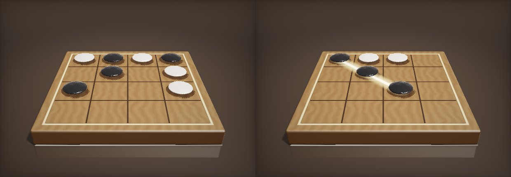

# หมากสามเรียง 3D (XO 3D)

เกมหมากสามเรียงบนกระดาน 4×4 เรนเดอร์เป็น 3 มิติด้วย WebGL ray marching เขียนเองล้วน ๆ
ไม่พึ่ง three.js หรือ A-Frame — **ทั้งเกมอยู่ในไฟล์ `index.html` ไฟล์เดียว**

## กติกา

- ผู้เล่นมีหมากฝั่งละ **4 เม็ด** (ดำ / ขาว แบบหมากโก๊ะ) บนกระดาน **4×4**
- **ช่วงแรก** ผลัดกันวางหมากลงช่องว่าง จนครบฝั่งละ 4 เม็ด
- **ช่วงที่สอง** ผลัดกัน *เดิน* หมากของตัวเองไป **ช่องว่างไหนก็ได้** ไม่ต้องเป็นช่องที่ติดกัน
- ใครเรียงหมากได้ **3 เม็ดติดกัน** ในแนวตั้ง แนวนอน หรือแนวทแยง ก่อน = ชนะ
  (กระดาน 4×4 นับแนวยาว 3 ช่องที่ซ้อนทับกันได้ รวม **24 เส้นชนะ** มากกว่ากระดาน 3×3 เดิม
  ที่มีแค่ 8 เส้น เกมเลยตัดสินไวขึ้นมาก ไม่ต้องพึ่งดวงเหมือนกระดานเล็ก)

ตัวเลือกกติกาในเมนู:

| ตัวเลือก | ค่าเริ่มต้น | ความหมาย |
|---|---|---|
| เดินได้เฉพาะช่องติดกัน | ปิด | เปิด = ย้ายได้เฉพาะช่องที่ติดกัน (รวมทแยง) |

**กติกาซ่อนสำหรับฝ่ายดำ (ผู้เดินก่อน):** ห้ามเดินตาที่เปิดช่องชนะพร้อมกันตั้งแต่ 2 ทางขึ้นไป
(เช่นวางสองเม็ดติดกันกลางแนวยาว 4 ช่องโดยทั้งสองปลายว่าง) ยกเว้นตานั้นชนะเลยทันที —
ถ้าไม่ห้าม ฝ่ายดำจะบังคับชนะได้แทบทุกเกมภายใน ~4 ตา เพราะกระดานนี้มีเส้นชนะซ้อนทับกันเยอะมาก
(คล้ายกติกาห้ามหมากสามซ้อนของฝ่ายดำในโกะโมกุ/หมากห้า) ฝ่ายขาวไม่มีข้อจำกัดนี้

## โหมดการเล่น

- **แข่งกับคอมพิวเตอร์** — 3 ระดับ (negamax + alpha-beta + iterative deepening)
- **แข่งกับเพื่อน** — ผลัดกันเล่นบนเครื่องเดียวกัน
- **เล่นออนไลน์** — สร้างห้องได้รหัส 5 ตัว ส่งให้เพื่อน เชื่อมตรงสองเครื่องผ่าน WebRTC (PeerJS)
  ไม่มีเซิร์ฟเวอร์เกมของเราเอง

## วิธีเล่น

ดับเบิลคลิก `index.html` ได้เลย ไม่ต้องติดตั้งอะไร

โหมดออนไลน์ต้องให้ทั้งสองฝ่ายเปิดหน้าเว็บเดียวกัน — เอาขึ้น GitHub Pages แล้วส่งลิงก์ให้เพื่อน
หรือส่งไฟล์นี้ให้เพื่อนไปเปิดเองก็ได้ (ต่ออินเทอร์เน็ตเพื่อโหลด PeerJS)

เปิดลิงก์ที่ลงท้ายด้วย `#รหัสห้อง` จะเด้งเข้าหน้าเข้าร่วมห้องให้อัตโนมัติ

## การควบคุม

| ทำอะไร | วิธี |
|---|---|
| หมุนกระดาน | ลากเมาส์ / ลากนิ้ว (เริ่มต้นเป็นมุมหน้าตรง ก้มลงเล็กน้อย) |
| ซูม | สกอร์ล |
| วาง/เดินหมาก | คลิกที่ช่อง |
| สลับมุมกล้องสำเร็จรูป | ปุ่ม ⌖ |

## เบื้องหลัง

ฉากทั้งหมดเป็น signed distance field ที่เดินรังสีทีละสเต็ปใน fragment shader ตัวเดียว

- **หมากโก๊ะ** = ส่วนร่วมของทรงกลมสองลูกที่เหลื่อมกัน (รูปเลนส์นูนสองด้าน) เชื่อมด้วย `smax`
  เพื่อลบสันคมตรงเส้นศูนย์สูตร
- **กระดาน** = rounded box + ลายเสี้ยนไม้ procedural + เส้นตารางฝังสีเข้ม (ขนาดกระดาน/จำนวนหมาก
  เป็นค่าคงที่ `BOARD_N`/`PIECES_PER_SIDE` ต้นไฟล์ ส่งต่อเข้า shader ผ่าน JS template literal
  โดยตรง เปลี่ยนที่เดียวแล้วทุกอย่างตามกันหมด)
- แสง: soft shadow แบบชดเชยระยะระหว่างสเต็ป, ambient occlusion, พื้นสะท้อนเงา, ACES tone mapping
- เสียงวางหมากสังเคราะห์สดด้วย WebAudio ไม่มีไฟล์เสียง
- **AI** ใช้ negamax + alpha-beta + iterative deepening น้ำหนักตำแหน่งอิงจาก "ช่องนี้เป็นส่วนหนึ่ง
  ของกี่เส้นชนะ" (ทั่วไปสำหรับกระดานขนาดไหนก็ได้ ไม่ฮาร์ดโค้ด "มุม/กลาง")

### บทเรียนที่แลกมาด้วยการดีบัก

- `calcNormal` ต้องใช้ epsilon **ใหญ่พอ** (0.018) ไม่งั้นผลต่างของ SDF จะจมไปกับความละเอียดของ
  `float` แล้วผิวหมากขึ้นริ้วเป็นวง ๆ เหมือนลายนิ้วมือ — เพิ่มความละเอียดการเดินรังสีไม่ช่วย
- soft shadow ที่ใช้ `min(k*h/t)` ตรง ๆ ทำให้เกิดริ้วเป็นแถบบนผิวโค้ง ต้องชดเชยระยะระหว่างสเต็ป
- ก้นกระดานห้ามอยู่ระนาบเดียวกับพื้นเป๊ะ ๆ ไม่งั้นการทดสอบเงารั่วเป็นแถบสว่างพาดใต้ขอบ
- **กระดานใหญ่ขึ้น = ต้องคิดเรื่องบังคับชนะใหม่** กระดาน 4×4 (24 เส้นชนะ) เปิดช่องให้ฝ่ายเดินก่อน
  สร้าง "คู่เปิดหัวท้าย" (double-open fork) ได้เสมอ ซึ่งเป็นการบังคับชนะ — ต้องเพิ่มกติกาห้ามฝ่ายดำ
  เดินตาที่เปิดช่องชนะพร้อมกัน 2 ทางขึ้นไปเพื่อแก้
- **ตัวกรองกติกาแพงห้ามอยู่ในลูปค้นหาลึกของ AI** ใส่ fork-filter ไว้ใน `legalMoves()` ตรง ๆ
  ทำให้ negamax เรียกมันซ้ำเป็นแสนครั้งตอนค้นลึกจนแท็บค้าง ต้องย้ายไปกรองแค่ที่ "จุดตัดสินใจจริง"
  (root ของ AI, ตาของผู้เล่นจริง, ไฮไลต์บนจอ) เท่านั้น
- **เช็คเวลาของ AI ตามความลึก (ply) ใช้ไม่ได้กับกิ่งก้านที่เยอะขึ้น** เดิมเช็คทุก 4 ชั้นความลึก
  ซึ่งพอกับกระดานเล็ก แต่กระดานที่กิ่งก้านต่อตาเยอะ (~48 ทาง) อาจสำรวจโหนดเป็นล้านก่อนถึงจุดเช็คแรก
  ต้องเปลี่ยนเป็นนับจำนวนโหนดที่สำรวจจริงแทน ไม่ว่ากิ่งก้านจะหน้าตายังไงก็เช็คถี่สม่ำเสมอ

## ทดสอบแล้ว

- 24 เส้นชนะไม่ซ้ำกัน ทุกเส้นต่อเนื่องจริง ทดสอบชนะทุกทิศทั้งแนวหลักและแนวซ้อนทับถูกต้อง
- AI ระดับยากและปานกลางชนะฝ่ายเดินสุ่มแทบทุกเกม (ทั้งเดินก่อนและเดินหลัง)
- ยืนยันด้วยการจำลองว่าถ้าไม่ห้ามฝ่ายดำสร้างฟอร์ก จะบังคับชนะได้ทุกเกมภายใน ~4 ตา
  หลังเพิ่มกติกาห้ามฟอร์กแล้วเกมยืดเป็น ~10 ตาขึ้นไป และฝ่ายที่เก่งกว่า (ไม่ใช่แค่สีดำ) เป็นฝ่ายได้เปรียบ
- เล่นจบเกมเต็มรูปแบบผ่าน `PointerEvent` จริง (ไม่เรียกฟังก์ชันตรง ๆ) พร้อมมือสั่นและกดค้างสุ่ม
  ทุกคลิก แล้วเทียบภาพที่เรนเดอร์จริงกับตรรกะเกมทุกตา — ตรงกันครบ ไม่มีคลิกไหนหลุด
- โหมดออนไลน์ทดสอบจับคู่จริงสองเครื่อง ซิงก์ครบทั้งช่วงวางและช่วงเดิน กันการเดินผิดตา
  และจับสัญญาณอีกฝ่ายหลุดได้
